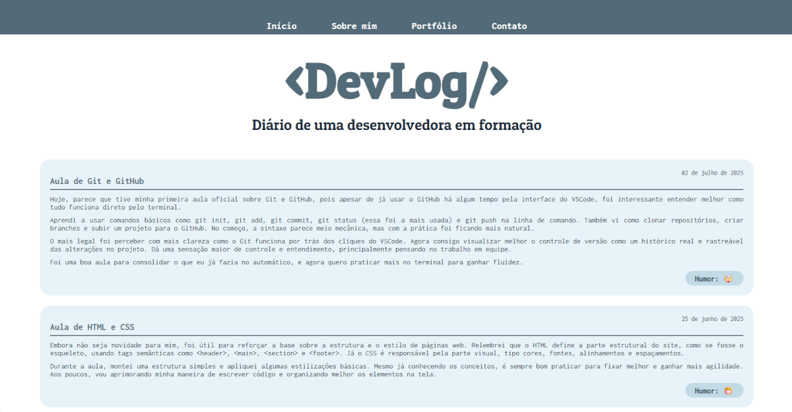
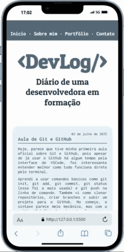

# DevLog – Diário de uma desenvolvedora em formação

Projeto pessoal feito com HTML e CSS, simulando um diário ou blog. Com foco em prática de semântica, organização de conteúdo e estilos visuais. Desenvolvido como atividade do curso de Desenvolvimento de Software, aplicando conceitos de layout, responsividade e modo escuro automático.

## ✍🏻 Sobre o Projeto

O **DevLog** é uma página web estática, construída como um blog ou diário pessoal. Possui seções de Diário, Sobre mim, Portfólio e Contato, organizadas em um layout limpo, moderno e agradável.

## 🎯 Objetivos

- Consolidar o uso de HTML semântico (`<main>`, `<section>`, `<article>`, `<header>`, `<footer>`, `<time>`)

- Aprimorar habilidades em CSS para criar layouts modernos, incluindo:

  - Layout responsivo para diferentes tamanhos de tela
  - Implementação de modo escuro automático, que acompanha as preferências do sistema ou do navegador do usuário, através do `prefers-color-scheme`. Aprender boas práticas de organização de arquivos

- Publicar uma página.

## 🛠️ Tecnologias e Ferramentas

- VSCode
- HTML5
- CSS3

## 📂 Estrutura

```
Projeto/
├── index.html
├── README.md
└── src/
    ├── css/
    │   ├── darkmode.css
    │   ├── responsive.css
    │   └── style.css
    └── images/
```

## 📸 Screenshots
<p>
  
  


## 🔗 Link do Projeto

DevLog: https://mariana4ads.github.io/diariodev


---

> Projeto desenvolvido por [Mariana Rocha](http://linkedin.com/in/mariana4ads)